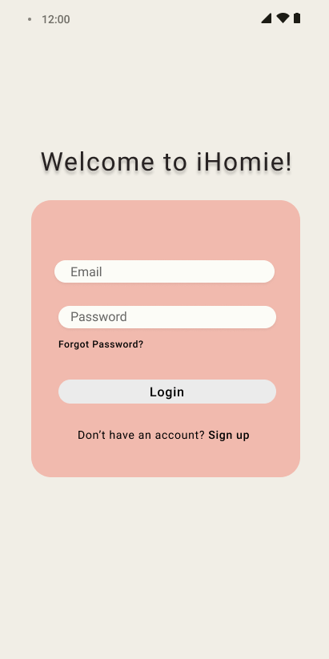
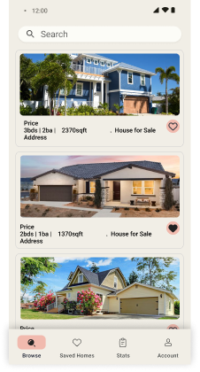
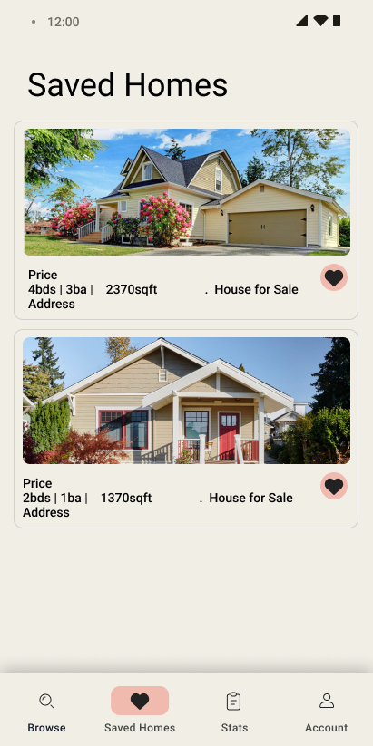
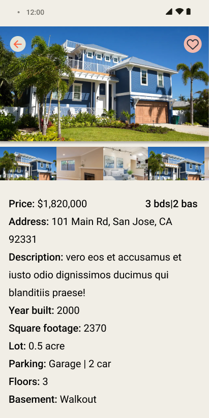
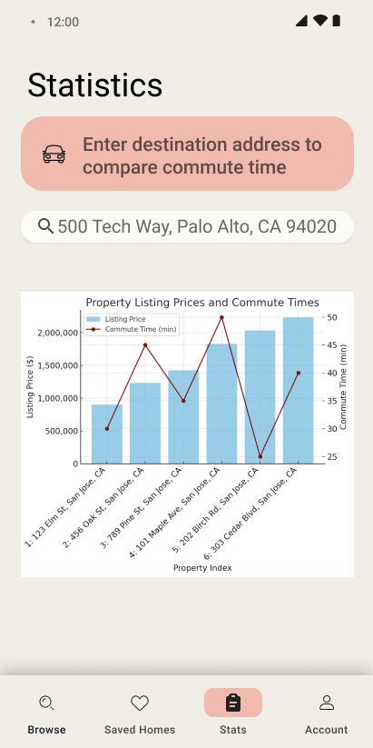
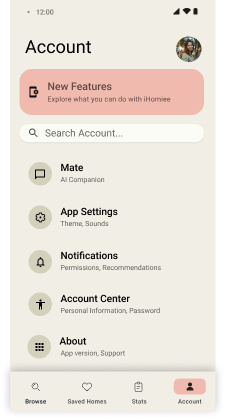
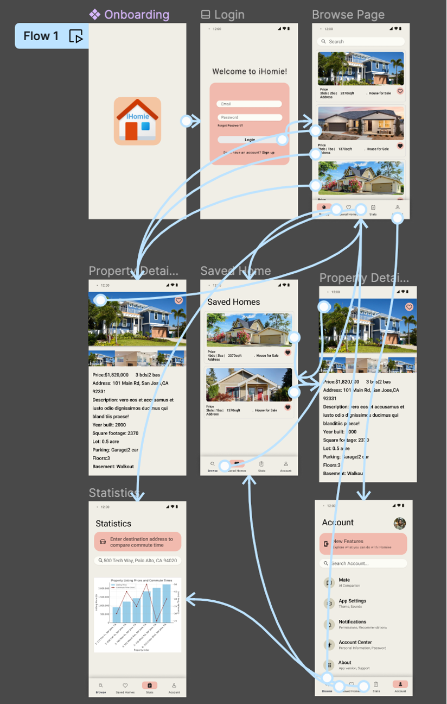

# Milestone 1 - iHomie GROUP 5 (Unit 9)

## Table of Contents

1. [Overview](#Overview)
1. [Product Spec](#Product-Spec)
1. [Wireframes](#Wireframes)

## Overview

### Description

iHomie is an app that allows users to search, filter, get statistics of specific properties and the real estate market. (i.e. by address or zipcode, etc). User can also leverage the app to get property recommendations, real estate trends, and save their favorite listings.

### App Evaluation

[Evaluation of your app across the following attributes]
- **Category:** Real Estate, Finance, Lifestyle
- **Mobile:** 
    - Maps - Mapping functionality to show nearby homes for sale, open houses, and property details overlaid on the map.
    - Location Tracking - Provide local property recommendations based on user's current location
    - Push Notifications  - Notify user of favorite listing changes and real estate trends
    - Dark mode -user can switch to dark mode option for viewing in dark setting. 
- **Story:** The app can be an assistant for the user to search and find their ideal properties with certain criteria/paramters. It can also be a helpful tool for people like agents and researchers to get general statistics of real estate information such as zipcode, price range, number of bedrooms,date listed, year built, neighborhoods,etc. in a certain area.
- **Market:** The app displays accurate information about the current market where users can find what they search. Target users of this app would include: Homeowners, Home buyers, Renters, Realty Agents, Architects, Researchers, Investors.
- **Habit:** Users can browse throughout the day many times. Featured New Listings section will show appealing pictures and info of newly listed property of the day.Nofication feature would remind user to check newly listed properties or properties with a price drop. 
- **Scope:** Main Stream screen to view different house listings and where you can filter by zip code,bedrooms, or price range. Another Stream screen with user's favorited listings, User can favorite listings on Stream and Detail screens, Detail screen displaying house listing information.Maps,push notification, sensors and location tracking are optional. Even without stretch features, this app is worth building with its basic search and save features.

## Product Spec

### 1. User Features (Required and Optional)

**Required Features**

1. User can search property by zipcode. 
2. User can scroll search results which contains property address, number of bedrooms, price, and image.
3. User can click any search result to view details of a property,which include more pictures, detailed property information such as footage, year built, number of rooms, garage space, listing history, transaction history, neighborhood information.
4. User can add an interested property to favorite. Data in "Saved Homes" is persistent. When user relaunches the app, the saved homes list is unchanged.

**Optional Features**
1. Stats screen showing the prices of saved properties and different commute time to a destination address(workplace, school) entered by user. 
2. Account screen for user preferences, notification, dark mode.
3. Ai could be used to analyze real state statistics (from the api) by answering questions about trends, market insights,specific data points, or recommendations tailored to the user's prompts.
4. Ability to access users location and find local properties.
5. Map showing location of saved properties, commute time, nearby facilities.

### 2. Screen Archetypes
-Onboarding Screen
    - A personalized launcher with iHomie Logo, which is a house icon with "iHomie" text.     
- Login Screen
    - User can enter user name(EditView), password(EditView), and click login button(Button).
    - User can also create a new account by clicking "Sign up" link.
- Browse Screen(Home/Search Screen)
    - Users can view a list of properties by their last known location by default, or if location is disabled, a list of properties from Los Angeles, CA will be shown
    - Users can search for properties by zipcode or address(search bar), view results in a vertical recyclerview, and click heart icon to save a property to favorites.
    - Each search result in the recyclerviw contains property address, number of bedrooms, price, and 1 image.
    - User can filter the search using parameters like min/max price, min/max bedrooms, min/max bathrooms, min/max sqft, garage, and pool.
    - User can go back to the Browse screen with their last search parameters retained.
    - There is a bottom navigation menu with options of "Browse","Saved Homes","Stats","Account".
- Property Detail Screen
  - Users can view detailed information about a specific property, including images(horizontal recyclerview), footage, year built, rooms, garage space, listing history, 
    transaction history, neighborhood information, etc. Detailed information of the property is contained in a vertical scolling view.
  - Users can click the heart icon to add a property to "Saved Homes".
  - User can click <- to go back to the Browse screen.
  - User can click phone number in the Property Detail vertical scrollable view to make calls
- Saved Homes screen (Favorites Screen)
    - Users can view a list of favorited properties(vertical recyclerview) and remove properties from favorites if desired.
    - Users can go click any propety to go to detailed view of that property.
    - There is a bottom navigation menu with options of "Browse","Saved Homes","Stats","Account".
- Statistics Screen(optional)
    - Users can enter a destination address in search bar, and see a chart showing prices of saved properties, and different commute time.
    - There is a bottom navigation menu with options of "Browse","Saved Homes","Stats","Account".
- Account Screen (Optional)
    - Users can change account settings for user preferences, notifications, and toggling dark mode.
- AI Insights (Optional)
    -  Users can access AI-powered real estate statistics, insights, and recommendations.
- Map View(optional)
    - Users can view properties overlaid on a map, including nearby homes for sale and open houses.

### 3. Navigation Flows

**Tab Navigation** (Tab to Screen)

* Browse(Home)
* Saved Homes(favorites)
* Stats 
* Account (Optional)
* AI Insights (Optional)
* Map(optional)

**Flow Navigation** (Screen to Screen)

- Onboarding
    =>Login Screen
- Login Screen
     => Browse screen 
- Browse Screen 
     => Property Detail Screen
- Property Detail Screen:
    => Browse Screen
- Saved Homes:
    =>Property Detail Saved Homes Screen
- Property Detail Saved Homes Screen:
    => Saved Homes
- Account(optional):
    - leads to Browse screen: Upon tapping on "Browse" at bottom navigation menu.
    - leads to Statistics screen: Upon tapping on "Stats" at bottom navigation menu.
    - leads to Account screen(optional): Upon tapping on "Account" at bottom navigation menu.
- AI Insights(optional):
    - Browse: Upon tapping on "Browse" at bottom navigation menu.
 - Map View: (Optional) Upon tapping on map view button
   - Browse: Upon tapping on "Browse" at bottom navigation menu.

## Wireframes
    
    

### [BONUS] Digital Wireframes & Mockups
    
    

https://www.figma.com/file/ROkz3bhHwBu3HADjl3oNp2/iHomie?type=design&node-id=0%3A1&mode=design&t=MbAQlYKpJeaI37gI-1

### [BONUS] Interactive Prototype

 
 
 https://www.figma.com/file/ROkz3bhHwBu3HADjl3oNp2/iHomie?type=design&node-id=0%3A1&mode=design&t=MbAQlYKpJeaI37gI-1

# Milestone 2 - Build Sprint 1 (Unit 8)

## GitHub Project board

## Issue cards

## Issues worked on this sprint
 - Custom launcher implemented.  A house icon with "iHomie" logo shows first during onboarding process.
 - Login feature implemented. User can sign up or sign in on the Login screen. "iHomie" shows at top of the screen.
 - Property Browsing feature implemented.Data parsing using Get/propertyExtendedSearch successful. User can search property by address, city, or code with the search bar.Results 
   appear in vertical recyclerView.Float button added to property images to be later used for adding a property to Saved Homes screen.
 - Property Detail feature implemented. Data parsing from Browse Screen successful. Used 2 zillow API endpoints. Get/images for the horizontal RecyclerView of pictures. Get/property 
   for content in vertical scroll view. When user clicks an image in horizontal RecyclerView of pictures, picture shows in the BigImageView above the thumbnails.Float button to save 
   property to SavedHomes screen added to big picture.
 - Account Settings PreferenceScreens have been created with their respective fragments. A test button to enter the screen has been implemented, but there is currently a bug where the app
   crashes if trying to change to the Account screen.

Browse Screen with searching functionality-by Anson

Login screen-by Abdinahmen
- Users can login using email
- Users can login using google sign in

Custom launcher and Property Detail-by Yan
- Custom Launcher
- User can signup and login
- User can search by address, zipcode and city
- User can click any individual property in search result and see details of that property.

 

# Milestone 3 - Build Sprint 2 (Unit 9)

## GitHub Project board

## Completed user stories

- List the completed user stories from this unit
  - GPS tracker option enabled.
  - Browse screen populated with property lists of user's last known location when first loaded. 
  - Filter search results on Browse based on user's choice and input, such as ForRent, ForSale, RecentlySold, Houses, Townhomes, minBeds, maxPrice, etc. Toggle-able filter gives 
     user a better view of the search results.
  - User can visit another fragment and come back to browse to view latest search results.
  - User can click heart-shaped button on Browse screen to favor/unfavor a property. Favored property will be shown on SavedHomes screen.
  - Data in "Saved Homes" is persistent. When user relaunches the app, the saved homes list is unchanged.
  - User can click heart-shaped button on SavedHomes screen to unfavor a property. Unfavored property will be removed from SaveHomes screen. Once user goes back to Browse, heart 
     button on the unfavored property changes to white.
  - User can click a property on SavedHomes screen to view its details on Property Detail screen.
  - User can view statistics(min, max and average price) of saved homes on Statistics screen.
  - User can change light/dark theme in Account screen, and light/dark mode will apply to the whole app.
 
   
- List any pending user stories / any user stories you decided to cut
from the original requirements
  - AI assistant feature.(Optional feature)
  - Market/trend statistics.(Optional feature)
  - Gravity orientation.(Optional feature)

Location-based default browse screen - Users can get a default result in the browse screen based on their last-known location, if location is disabled, result from the default city (San Jose, CA) will be shown.

Save/unsave buttons on browse and save home screens - Users can save properties with the save buttons, view the list of favorited properties, and remove properties from favorites. Color of the button will change dynamically to reflect the state of the property.

Display statistics (e.g. average, minimum, and maximum price) based on the user's favorited properties. Statistics will change dynamically to reflect the information of the currently favorited properties.

Mock settings screen - Includes placeholder settings for app's final product. Currently,  users may change the theme from light mode or dark mode.

Filtered search results based on user's choice and input, such as ForRent, ForSale, RecentlySold, Houses, Townhomes, minBeds, maxPrice, etc. Toggle-able filter to give user a better view of the search result.

Login screen has a flying in 3d iHomie logo.

When user click on any phone number, it will trigger phone's dial pad and calling feature.

### [App  Video](https://www.youtube.com/watch?v=yo-wLrQHV30)
