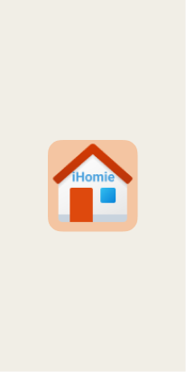
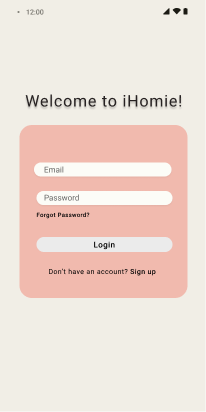
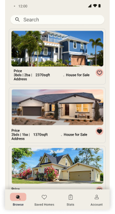
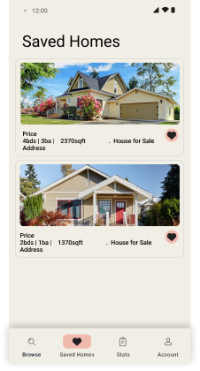
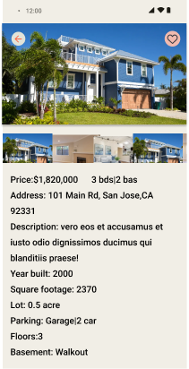
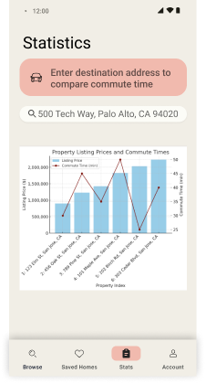
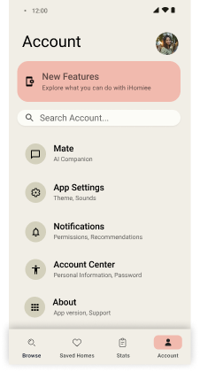

# Milestone 1 - iHomie GROUP 5 (Unit 7)

## Table of Contents

1. [Overview](#Overview)
1. [Product Spec](#Product-Spec)
1. [Wireframes](#Wireframes)

## Overview

### Description

iHomie is an app that allows users to search, filter, get statistics of specific properties and the real estate market. (i.e. by address or zipcode, etc). User can also leverage the app to get property recommendations, real estate trends, and save their favorite listings.

### App Evaluation

[Evaluation of your app across the following attributes]
- **Category:** Real Estate, Finance, Lifestyle
- **Mobile:** 
    - Maps - Mapping functionality to show nearby homes for sale, open houses, and property details overlaid on the map.
    - Location Tracking - Provide local property recommendations based on user's current location
    - Push Notifications  - Notify user of favorite listing changes and real estate trends
    - Dark mode -user can switch to dark mode option for viewing in dark setting. 
- **Story:** The app can be an assistant for the user to search and find their ideal properties with certain criteria/paramters. It can also be a helpful tool for people like agents and researchers to get general statistics of real estate information such as zipcode, price range, number of bedrooms,date listed, year built, neighborhoods,etc. in a certain area.
- **Market:** The app displays accurate information about the current market where users can find what they search. Target users of this app would include: Homeowners, Home buyers, Renters, Realty Agents, Architects, Researchers, Investors.
- **Habit:** Users can browse throughout the day many times. Featured New Listings section will show appealing pictures and info of newly listed property of the day.Nofication feature would remind user to check newly listed properties or properties with a price drop. 
- **Scope:** Main Stream screen to view different house listings and where you can filter by zip code,bedrooms, or price range. Another Stream screen with user's favorited listings, User can favorite listings on Stream and Detail screens, Detail screen displaying house listing information.Maps,push notification, sensors and location tracking are optional. Even without stretch features, this app is worth building with its basic search and save features.

## Product Spec

### 1. User Features (Required and Optional)

**Required Features**

1. User can search property by zipcode. 
2. User can scroll search results which contains property address, number of bedrooms, price, and image.
3. User can click any search result to view details of a property,which include more pictures, detailed property information such as footage, year built, number of rooms, garage space, listing history, transaction history, neighborhood information.
4. User can add an interested property to favorite. Data in "Saved Homes" is persistent. When user relaunches the app, the saved homes list is unchanged.

**Optional Features**
1. Stats screen showing the prices of saved properties and different commute time to a destination address(workplace, school) entered by user. 
2. Account screen for user preferences, notification, dark mode.
3. Ai could be used to analyze real state statistics (from the api) by answering questions about trends, market insights,specific data points, or recommendations tailored to the user's prompts.
4. Ability to access users location and find local properties.
5. Map showing location of saved properties, commute time, nearby facilities.

### 2. Screen Archetypes
-Onboarding Screen
    - A personalized launcher with iHomie Logo, which is a house icon with "iHomie" text.     
- Login Screen
    - User can enter user name(EditView), password(EditView), and click login button(Button).
    - User can also create a new account by clicking "Sign up" link.
- Browse Screen(Home/Search Screen)
    - Users can search for properties by zipcode or address(search bar), view results in a vertical recyclerview, and click heart icon to save a property to favorites.
    - Each search result in the recyclerviw contains property address, number of bedrooms, price, and 1 image.
    - There is a bottom navigation menu with options of "Browse","Saved Homes","Stats","Account".
- Property Detail Screen
  - Users can view detailed information about a specific property, including images(horizontal recyclerview), footage, year built, rooms, garage space, listing history, 
    transaction history, neighborhood information, etc. Detailed information of the property is contained in a vertical scolling view.
  - Users can click heart icon to add a property to "Saved Homes".
  - User can click <- to go back to Browse screen.
- Saved Homes screen (Favorites Screen)
    - Users can view a list of favorited properties(vertical recyclerview) and remove properties from favorites by long click if desired.
    - Users can go click any propety to go to detailed view of that property.
    - There is a bottom navigation menu with options of "Browse","Saved Homes","Stats","Account".
- Statistics Screen(optional)
    - Users can enter a destination address in search bar, and see a chart showing prices of saved properties, and different commute time.
    - There is a bottom navigation menu with options of "Browse","Saved Homes","Stats","Account".
- Account Screen (Optional)
    - Users can change account settings for user preferences, notifications, and toggling dark mode.
- AI Insights (Optional)
    -  Users can access AI-powered real estate statistics, insights, and recommendations.
- Map View(optional)
    - Users can view properties overlaid on a map, including nearby homes for sale and open houses.

### 3. Navigation Flows

**Tab Navigation** (Tab to Screen)

* Browse(Home)
* Saved Homes(favorites)
* Stats 
* Account (Optional)
* AI Insights (Optional)
* Map(optional)

**Flow Navigation** (Screen to Screen)

- Onboarding
    =>Login Screen
- Login Screen
     => Browse screen 
- Browse Screen 
     => Property Detail Screen
- Property Detail Screen:
    => Browse Screen
- Saved Homes:
    =>Property Detail Saved Homes Screen
- Property Detail Saved Homes Screen:
    => Saved Homes
- Account(optional):
    - leads to Browse screen: Upon tapping on "Browse" at bottom navigation menu.
    - leads to Statistics screen: Upon tapping on "Stats" at bottom navigation menu.
    - leads to Account screen(optional): Upon tapping on "Account" at bottom navigation menu.
- AI Insights(optional):
    - Browse: Upon tapping on "Browse" at bottom navigation menu.
 - Map View: (Optional) Upon tapping on map view button
   - Browse: Upon tapping on "Browse" at bottom navigation menu.

## Wireframes
    
    

### [BONUS] Digital Wireframes & Mockups
    
    

https://www.figma.com/file/ROkz3bhHwBu3HADjl3oNp2/iHomie?type=design&node-id=0%3A1&mode=design&t=MbAQlYKpJeaI37gI-1

### [BONUS] Interactive Prototype

 
 
 https://www.figma.com/file/ROkz3bhHwBu3HADjl3oNp2/iHomie?type=design&node-id=0%3A1&mode=design&t=MbAQlYKpJeaI37gI-1

# Milestone 2 - Build Sprint 1 (Unit 8)

## GitHub Project board

[Add screenshot of your Project Board with three milestones visible in
this section]

## Issue cards

- [Add screenshot of your Project Board with the issues that you've been working on for this unit's milestone] 
- [Add screenshot of your Project Board with the issues that you're working on in the **NEXT sprint**. It should include issues for next unit with assigned owners.] 

## Issues worked on this sprint

- List the issues you completed this sprint
- [Add giphy that shows current build progress for Milestone 2. Note: We will be looking for progression of work between Milestone 2 and 3. Make sure your giphys are not duplicated and clearly show the change from Sprint 1 to 2.]

 

# Milestone 3 - Build Sprint 2 (Unit 9)

## GitHub Project board

[Add screenshot of your Project Board with the updated status of issues for Milestone 3. Note that these should include the updated issues you worked on for this sprint and not be a duplicate of Milestone 2 Project board.] 

## Completed user stories

- List the completed user stories from this unit
- List any pending user stories / any user stories you decided to cut
from the original requirements

[Add video/gif of your current application that shows build progress]

## App Demo Video

- Embed the YouTube/Vimeo link of your Completed Demo Day prep video
